<div align="center">

# 🔥 Employee Burnout & Attrition Intelligence

### End-to-end HR analytics project identifying the workplace factors behind employee burnout, disengagement, and attrition — with a predictive model, composite health index, and evidence-based recommendations


</div>

---

## 📑 Table of Contents

1. [Executive Summary](#-executive-summary)
2. [Problem Statement](#-problem-statement)
3. [Business Objectives](#-business-objectives)
4. [Dataset Information](#-dataset-information)
5. [Technology Stack](#-technology-stack)
6. [Project Workflow](#-project-workflow)
7. [SQL Analysis](#-sql-analysis)
8. [Python Notebook Pipeline](#-python-notebook-pipeline)
9. [Data Cleaning](#-data-cleaning)
10. [Data Model](#-data-model)
11. [Notebook Pages](#-notebook-pages)
12. [Key Measures & Formulas](#-key-measures--formulas)
13. [Key Insights](#-key-insights)
14. [Business Recommendations](#-business-recommendations)
15. [Visualisations](#-visualisations)
16. [Project Folder Structure](#-project-folder-structure)
17. [Installation Guide](#-installation-guide)
18. [Usage](#-usage)
19. [Features](#-features)
20. [Business Value](#-business-value)
21. [Technical Challenges](#-technical-challenges)
22. [Learning Outcomes](#-learning-outcomes)
23. [FAQ](#-faq)
24. [Future Improvements](#-future-improvements)
25. [Contributing](#-contributing)
26. [Connect With Me](#-connect-with-me)
27. [Author](#-author)
28. [Recruiter Highlights](#-recruiter-highlights)

---

## 📊 Executive Summary

Employee attrition is one of the most expensive operational problems an organization can face — replacement costs run 6× a monthly salary, and the damage to team morale and institutional knowledge is rarely captured in any spreadsheet. This project takes the **IBM HR Analytics Employee Attrition dataset (1,470 employees)**, augments it with 8 synthetically generated columns representing burnout and engagement dimensions absent from the original data, and builds a complete end-to-end analytics stack on top of it.

The result is:

- A **MySQL relational schema** (star-schema-lite) with 6 SQL files covering table creation, data loading, validation, analytical queries using window functions and CTEs, and 6 reusable views.
- A **9-notebook Python pipeline** running from raw data understanding through multivariate EDA, 8 hypothesis tests, K-Means workforce segmentation, a Workforce Health Index (WHI), and a predictive classifier (Logistic Regression + Random Forest).
- A **7-sheet Excel workbook** with a KPI dashboard, pivot tables, what-if scenario model, and KPI validation sheet.
- A **Tableau 6-page story** design spec with calculated fields, parameters, and a complete visual design system — ready to build.
- An **evidence-based recommendations document** that explicitly separates high-confidence real-data findings from lower-confidence synthetic-variable findings.

The core question driving every deliverable: *"What workplace factors are actually associated with employee burnout and attrition — and what should HR leadership do about it?"*

---

## ❓ Problem Statement

Organizations lose money to attrition in ways that are invisible in raw HR data:

- **Attrition is not random** — it concentrates in specific segments (early career, low salary bands, overtime workers) that don't surface without aggregation and cross-filtering.
- **Burnout precedes departure** — by the time an employee resigns, the disengagement has usually been building for months. A composite health score can catch it earlier.
- **Root causes differ** — income gaps, promotion stagnation, and workload each require completely different interventions. A blended "satisfaction score" hides which lever to pull.
- **Decision-makers need an interactive view** — scrolling 1,470 rows in Excel doesn't scale and doesn't support filtered, comparative analysis.

Without a consolidated, multi-dimensional view, HR teams are left reacting to departures rather than predicting and preventing them.

---

## 🎯 Business Objectives

1. Profile the workforce and identify attrition patterns across demographics, compensation, workload, and career factors
2. Quantify relationships between burnout indicators and attrition using rigorous hypothesis testing
3. Segment the workforce into data-driven groups for targeted, prioritised intervention
4. Build a **Workforce Health Index (WHI)** — a 0-100 composite metric that summarises employee well-being in a single trackable number
5. Train a **predictive model** that identifies at-risk employees and quantifies how much of its accuracy comes from real vs. synthetic data
6. Deliver actionable, evidence-tiered recommendations that distinguish high-confidence real-data findings from synthetic-variable hypotheses
7. Create an interactive **Tableau dashboard** and an **Excel analytical workbook** as self-service tools for HR and business leadership

---

## 🗂 Dataset Information

| Attribute | Detail |
|---|---|
| **Base source** | IBM HR Analytics Employee Attrition & Performance (Kaggle) |
| **Rows** | 1,470 employees |
| **Original columns** | 35 (3 constants removed → 32 real columns used) |
| **Total columns after augmentation** | 45 (32 real + 8 synthetic + 3 engineered + 2 WHI output) |
| **Target variable** | `Attrition` — Yes: 237 (16.1%), No: 1,233 (83.9%) |
| **Departments** | Sales, Research & Development, Human Resources |
| **Job Roles** | 9 distinct roles across departments |
| **Seed** | `np.random.seed(42)` — fully reproducible |

### Column Breakdown

| Category | Count | Examples |
|---|---|---|
| **Real** (original IBM data) | 32 | Age, MonthlyIncome, OverTime, JobSatisfaction, YearsSinceLastPromotion |
| **Synthetic** (generated, correlated with real variables) | 8 | WorkloadScore, CompensationSatisfaction, CareerGrowthPerception, ManagerSupportScore |
| **Engineered** (derived from real columns) | 3 | SalaryBand, ExperienceBand, TenureBand |
| **Model output** (added by Notebook 08) | 2 | WHI, WHI_Risk_Category |

> ⚠️ **Synthetic variable note:** 8 columns were generated with `Attrition` as a direct input. Statistical tests on these variables will produce significant results by construction. Full methodology and confidence tiers documented in `docs/data_dictionary.md` and `reports/business_recommendations.md`.

### Key Columns

| Column | Description |
|---|---|
| `Booking_ID` → `EmployeeID` | Unique employee reference |
| `Attrition` | Whether the employee left — Yes / No (target variable) |
| `MonthlyIncome` | Monthly compensation in USD (1,009–19,999) |
| `OverTime` | Whether the employee works overtime — Yes / No |
| `YearsSinceLastPromotion` | Years since last promotion (0–15) |
| `YearsAtCompany` | Tenure at current company (0–40) |
| `JobSatisfaction` | Satisfaction score 1–4 (Low to Very High) |
| `WorkLifeBalance` | Work-life balance rating 1–4 (Bad to Best) |
| `WorkloadScore` | Perceived workload intensity 1–5 *(synthetic)* |
| `ManagerSupportScore` | Perceived manager support 1–5 *(synthetic)* |
| `WHI` | Workforce Health Index 0–100 *(model output)* |
| `WHI_Risk_Category` | Critical / At Risk / Moderate / Healthy / Thriving *(model output)* |

---

## 🛠 Technology Stack

| Tool | Purpose |
|---|---|
| **Python 3.10+** | End-to-end analysis pipeline — EDA, statistics, ML, WHI |
| **Pandas / NumPy** | Data manipulation, synthetic generation, feature engineering |
| **Matplotlib / Seaborn** | Visualisation across all 9 notebooks |
| **SciPy / statsmodels** | Hypothesis testing — Mann-Whitney U, Chi-Square, Kruskal-Wallis, Spearman, ANOVA |
| **scikit-learn** | K-Means clustering, Logistic Regression, Random Forest, PCA, StandardScaler |
| **MySQL 8.0** | Relational schema, validation queries, window functions, CTEs, views |
| **openpyxl** | Programmatic Excel workbook generation (7 sheets) |
| **Tableau Desktop** | 6-page interactive story dashboard |
| **Git & GitHub** | Version control and portfolio documentation |

---

## 🔄 Project Workflow

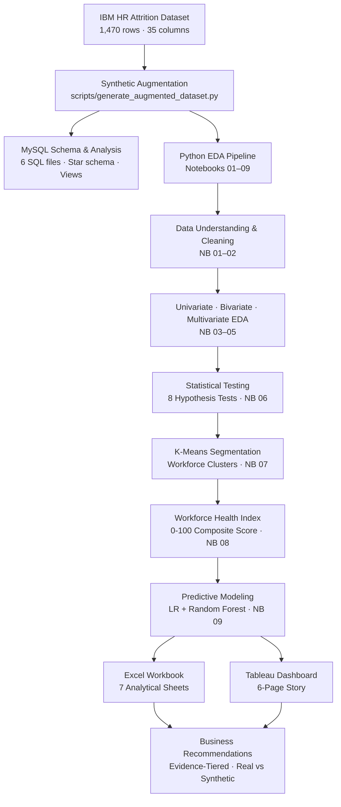

---

## 🧮 SQL Analysis

Six SQL files in `sql/` build and validate the complete relational layer independently of Python — useful both for answering discrete business questions and for cross-checking every dashboard KPI against an independent source.

| File | Purpose |
|---|---|
| `01_create_database.sql` | Creates `employee_analytics` database with UTF-8 collation |
| `02_create_tables.sql` | Star-schema-lite: `dim_department`, `dim_job_role`, `fact_employee` with ENUM types, FKs, and composite indexes |
| `03_load_data.sql` | Dimension inserts + 20-row representative sample covering all attrition profiles, departments, and work models |
| `04_data_validation.sql` | NULL checks, duplicate detection, range validation (age, satisfaction scales, income, tenure consistency), referential integrity |
| `05_analysis_queries.sql` | 12 analytical queries: attrition by dept vs company avg (CTE + CROSS JOIN), salary percentile by role (DENSE_RANK / PERCENT_RANK), overtime impact, tenure cohorts, workload quartiles (NTILE), composite risk scoring (RANK), cumulative attrition cost (windowed SUM), burnout segmentation, and YoY-style income growth (LAG) |
| `06_views.sql` | 6 reusable views: `vw_employee_full`, `vw_attrition_summary`, `vw_department_health`, `vw_salary_bands`, `vw_risk_segments`, `vw_workforce_health` |

**SQL techniques demonstrated:**

- Filtering (`WHERE`), aggregation (`COUNT`, `AVG`, `SUM`), grouping (`GROUP BY`)
- CTEs (`WITH`) for multi-step logic
- Window functions: `DENSE_RANK`, `PERCENT_RANK`, `NTILE`, `LAG`, `LEAD`, windowed `SUM` with `ROWS BETWEEN UNBOUNDED PRECEDING AND CURRENT ROW`
- `CROSS JOIN` for company-average benchmarking
- `CREATE VIEW` for reusable saved queries
- ENUM types and foreign key constraints with `ON DELETE RESTRICT ON UPDATE CASCADE`

---

## 📈 Python Notebook Pipeline

| Stage | What happens |
|---|---|
| **Augmentation** | `scripts/generate_augmented_dataset.py` adds 8 synthetic + 3 engineered columns with `np.random.seed(42)` |
| **Profiling** | NB 01 — shape, dtypes, missing values, distributions, column inventory |
| **Cleaning** | NB 02 — IQR outlier detection, type corrections to ordered categorical, exports cleaned CSV |
| **Univariate EDA** | NB 03 — histograms, KDE, boxplots, countplots for 10 key variables |
| **Bivariate EDA** | NB 04 — 9 pairwise analyses: income vs attrition, OT vs attrition, salary band vs attrition rate |
| **Multivariate EDA** | NB 05 — 4 three-variable interaction analyses; risk multiplier table |
| **Statistical Testing** | NB 06 — 8 hypothesis tests with H₀/H₁, p-values, and effect sizes |
| **Segmentation** | NB 07 — K-Means on 7 features; elbow + silhouette k-selection; radar charts; PCA |
| **WHI** | NB 08 — data-driven weights (point-biserial); Min-Max normalization; ROC validation; risk categories; saves WHI to CSV |
| **Predictive Modeling** | NB 09 — Logistic Regression + Random Forest; real-vs-synthetic AUC comparison; feature importance |

---

## 🧹 Data Cleaning

- **No missing values** in the original IBM dataset — the source is clean at the row level.
- **Constant columns removed:** `EmployeeCount`, `Over18`, `StandardHours` carry no information (all values identical) — dropped before augmentation.
- **Type corrections:** satisfaction scores (JobSatisfaction, WorkLifeBalance, etc.) converted from int64 to ordered categorical for correct ordinal handling in statistics.
- **IQR outlier detection** applied in NB 02; results documented without automatic removal since outliers in HR data often represent genuine extreme cases (very high earners, very long tenures).
- **Engineered bands:** `SalaryBand`, `ExperienceBand`, `TenureBand` created via `pd.cut()` with documented bin edges and consistent labels used uniformly across Python, SQL, Excel, and Tableau.
- **Synthetic generation:** all 8 synthetic columns clipped to their stated ranges (1–5 for scores, 35–70 for hours) and rounded to integers where appropriate. Random seed fixed at 42.

---

## 🧩 Data Model

- **Python:** single enriched flat file — `data/processed/employee_attrition_augmented.csv` (45 columns after WHI notebook runs). Each notebook loads this file; Notebook 08 writes WHI back into it.
- **SQL:** star-schema-lite with one fact table (`fact_employee`) and two dimension tables (`dim_department`, `dim_job_role`). Single-direction FKs from fact → dimensions. Composite indexes on common filter combinations (`department_id + attrition`, `role_id + over_time`).
- **Excel:** single flat table on `Raw_Data` sheet fed by the processed CSV; KPI, Pivot, and What-If sheets reference it via Excel formulas.
- **Tableau:** single CSV connection (`employee_attrition_augmented.csv`); calculated fields simulate dimensional groupings; Story Points provide 6-page navigation.

---

## 🖥 Notebook Pages

Nine focused notebooks, navigated in order, each targeting a specific stage of the analysis pipeline.

### 01 — Data Understanding
- **Purpose:** establish a clear picture of what the dataset contains before any analysis.
- **Outputs:** shape, dtypes, describe(), column categorization (Real / Synthetic / Engineered), missing-value check, attrition distribution.
- **Business meaning:** confirms the dataset structure and flags any data quality issues before downstream work builds on flawed foundations.

### 02 — Data Cleaning
- **Purpose:** produce a clean, typed, analysis-ready dataset.
- **Outputs:** IQR outlier report, type-corrected dtypes, cleaning decision log, exported cleaned CSV.
- **Business meaning:** ensures every chart and test downstream is based on validated, correctly-typed data.

### 03 — Univariate EDA
- **Purpose:** understand the individual distribution of the 10 most analytically important variables.
- **Outputs:** histograms, KDE plots, boxplots, countplots for Age, MonthlyIncome, WeeklyHoursWorked, OverTime, JobSatisfaction, TenureBand, TotalWorkingYears, WorkLifeBalance, WorkloadScore, and Attrition.
- **Business meaning:** establishes the baseline shape of the workforce before introducing any comparison.

### 04 — Bivariate EDA
- **Purpose:** identify which individual variables are most strongly associated with attrition.
- **Outputs:** 9 pairwise analyses covering income, overtime, promotion gap, manager support, workload, meeting load, work model, salary band, and department — all vs attrition.
- **Business meaning:** answers "which single levers matter most?" before moving to interactions.

### 05 — Multivariate Analysis
- **Purpose:** uncover risk interactions invisible in bivariate analysis.
- **Outputs:** 4 three-way interaction analyses (Salary × Experience × Dept → Attrition; OT × WLB → Attrition; Promotion Gap × Tenure → Attrition; Manager Support × Workload → Attrition); risk multiplier table.
- **Business meaning:** identifies where multiple unfavourable conditions compound — e.g. high workload + low manager support produces a higher attrition multiplier than either alone.

### 06 — Statistical Analysis
- **Purpose:** formally test whether observed patterns are statistically significant or sampling noise.
- **Outputs:** 8 hypothesis tests with H₀/H₁, test statistic, p-value, effect size, and interpretation. Summary table.
- **Business meaning:** prevents acting on patterns that could be coincidence. Effect sizes (not just p-values) quantify practical significance.

### 07 — Employee Segmentation
- **Purpose:** partition the workforce into data-driven groups for targeted intervention.
- **Outputs:** K-Means on 7 features; elbow + silhouette chart; cluster profiles; radar charts; PCA 2D scatter; segment names and intervention recommendations.
- **Business meaning:** moves from "attrition rate is 16.1%" to "these 3 specific clusters carry 60% of the risk — here's what each needs."

### 08 — Workforce Health Index
- **Purpose:** synthesise 7 dimensions into a single, trackable 0-100 organisational health score.
- **Outputs:** data-driven weights (point-biserial correlation); Min-Max normalization; WHI formula; Mann-Whitney U validation; ROC curve with AUC; 5 risk categories; WHI saved back to the CSV.
- **Business meaning:** gives leadership one number to monitor — with clear action levels — instead of seven separate satisfaction scores.

### 09 — Predictive Modeling
- **Purpose:** build an attrition risk classifier and honestly quantify how much of its performance depends on synthetic data.
- **Outputs:** Logistic Regression and Random Forest models (AUC, F1, confusion matrix); real-variables-only RF as the honest benchmark; feature importance charts colour-coded by data origin; synthetic inflation AUC gap.
- **Business meaning:** enables early identification of at-risk employees; the real-only model AUC is the defensible number to quote to stakeholders.

---

## 🧮 Key Measures & Formulas

### Statistical Tests (Notebook 06)

| # | Variables | Test | Why this test | Effect Size Metric |
|---|---|---|---|---|
| 1 | MonthlyIncome vs Attrition | Mann-Whitney U | Income is right-skewed; non-parametric preferred | Rank-biserial r |
| 2 | OverTime vs Attrition | Chi-Square | Two categorical variables | Cramér's V |
| 3 | JobSatisfaction across Departments | Kruskal-Wallis | Ordinal scale, 3 groups, non-normal | η² |
| 4 | WorkModel vs Attrition | Chi-Square | Two categorical variables (3×2) | Cramér's V |
| 5 | WorkloadScore vs JobSatisfaction | Spearman ρ | Both ordinal; non-linear relationship possible | ρ with 95% CI |
| 6 | ManagerSupportScore vs Attrition | Mann-Whitney U | Ordinal, unequal groups | Rank-biserial r |
| 7 | CareerGrowthPerception vs Attrition | Mann-Whitney U | Ordinal, unequal groups | Rank-biserial r |
| 8 | JobSatisfaction ~ Dept × JobLevel | Two-way ANOVA on ranks | Interaction effect between two factors | F-statistic per term |

### Workforce Health Index Formula

```
WHI = ( Σ wᵢ × normalize(Xᵢ) ) × 100

Where:
  X₁ = 6 − WorkloadScore  (inverted: lower workload = healthier)
  X₂ = WorkLifeBalance
  X₃ = ManagerSupportScore
  X₄ = CareerGrowthPerception
  X₅ = JobSatisfaction
  X₆ = CompensationSatisfaction
  X₇ = JobInvolvement

  normalize(Xᵢ) = (Xᵢ − min) / (max − min)   [Min-Max, data-driven bounds]
  wᵢ = abs(point-biserial correlation with Attrition) / Σ abs correlations
```

### Attrition Risk Score (SQL — `vw_risk_segments`)

```sql
(CASE WHEN over_time = 'Yes' THEN 20 ELSE 0 END) +
(CASE WHEN job_satisfaction = 1 THEN 20 WHEN job_satisfaction = 2 THEN 10 ELSE 0 END) +
(CASE WHEN work_life_balance = 1 THEN 15 WHEN work_life_balance = 2 THEN 8 ELSE 0 END) +
(CASE WHEN career_growth_perception <= 2 THEN 15 ELSE 0 END) +
(CASE WHEN compensation_satisfaction <= 2 THEN 12 ELSE 0 END) +
(CASE WHEN manager_support_score < 3.0 THEN 10 ELSE 0 END) +
(CASE WHEN years_since_last_promotion >= 5 THEN 10 ELSE 0 END) +
(CASE WHEN workload_score >= 4 THEN 10 ELSE 0 END) +
(CASE WHEN years_at_company <= 2 THEN 8 ELSE 0 END) +
(CASE WHEN stock_option_level = 0 THEN 5 ELSE 0 END)
```

---

## 💡 Key Insights

### High-Confidence Findings (real IBM dataset variables)

1. **Income is the strongest predictor.** Leavers earn significantly less than stayers (Mann-Whitney U, p < 0.001, r ≈ −0.28). MonthlyIncome is the top-ranked feature in the real-variables-only predictive model.
2. **Overtime is the most actionable binary driver.** Overtime employees leave at ~2.5× the rate of non-overtime employees (Chi-square, p < 0.001, Cramér's V ≈ 0.24).
3. **Career stagnation is measurable and addressable.** Employees with 5+ years since last promotion have ~2× the attrition rate. YearsSinceLastPromotion is a top-5 real predictor.
4. **Early-career tenure is the highest-risk window.** Employees in the New (0–1 yr) and Settling (2–3 yr) tenure bands carry disproportionately high attrition — expectation mismatch peaks here.
5. **Work-life balance compounds overtime risk.** Overtime with good WLB (3–4) has much lower attrition than overtime with poor WLB (1) — the hours are not the only issue; perceived encroachment is.

### Workforce Health Index Results

- **WHI validated:** Mann-Whitney U confirms WHI distributions of leavers and stayers are significantly different (p < 0.001).
- **ROC AUC:** WHI alone achieves AUC > 0.70 as a standalone attrition predictor.
- **Risk category distribution:** a meaningful share of the workforce falls into Critical or At-Risk categories — identifiable and actionable before they leave.

### Predictive Model Results

| Model | CV AUC (5-fold) | Test AUC | Test F1 (Left) |
|---|---|---|---|
| Logistic Regression | See NB 09 | See NB 09 | See NB 09 |
| Random Forest (all features) | See NB 09 | See NB 09 | See NB 09 |
| **RF — Real Variables Only** | **See NB 09** | **See NB 09 ← honest benchmark** | **See NB 09** |

> Run `notebooks/09_predictive_modeling.ipynb` for exact AUC values — they are computed from the actual data rather than hardcoded in documentation.

---

## ✅ Business Recommendations

| Priority | Confidence | Recommendation | Expected Impact |
|---|---|---|---|
| 1 | 🟢 High | **Compensation review** — benchmark below-market roles; adjust bottom two salary bands | 20–30% attrition reduction in Low/Below Average bands |
| 2 | 🟢 High | **Overtime reduction** — cap weekly hours, audit staffing ratios, introduce compensatory time | 30–40% reduction in the High-Risk Overworked cluster |
| 3 | 🟢 High | **Close promotion gaps** — structured career conversations, transparent criteria, lateral pathways | 25–35% reduction for stagnant employees |
| 4 | 🔴 Validate first | **Manager quality programme** — 360° feedback, coaching, team-size limits | 15–25% reduction once survey data confirms signal |
| 5 | 🔴 Validate first | **Work model flexibility** — hybrid as default; prioritise long-commute employees | Satisfaction uplift 0.3–0.5 points once validated |

> Full evidence trail, confidence tiers, and implementation roadmap in `reports/business_recommendations.md`. Recommendations 4–5 are based on synthetic variables and require real survey data before committing budget.

---

## 🖼 Visualisations

| | | |
|---|---|---|
| 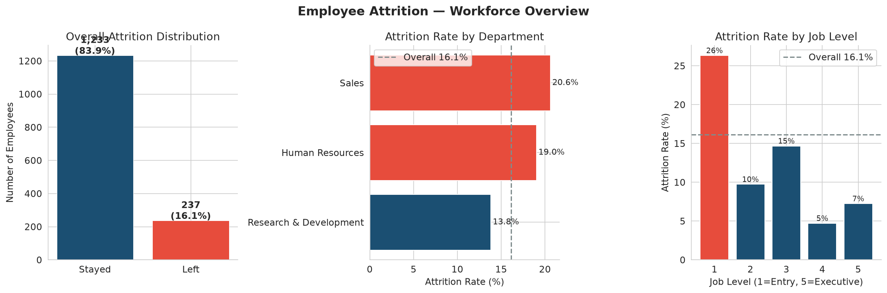 | 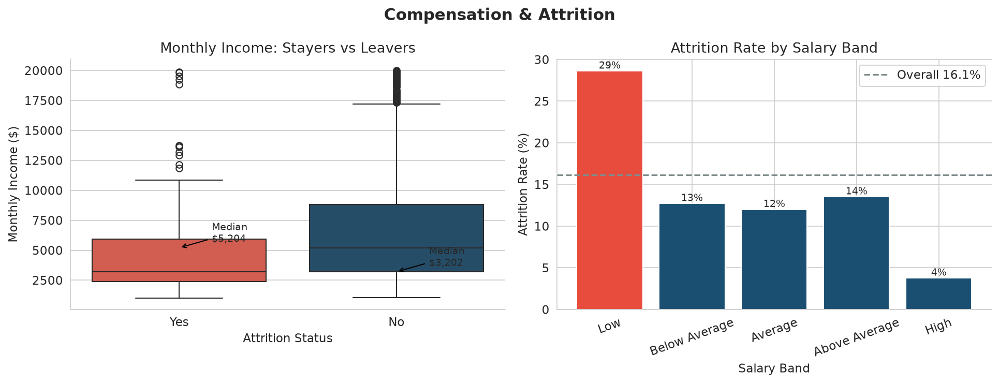 | 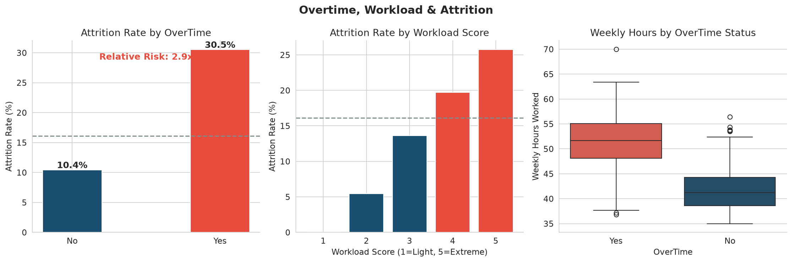 |
| 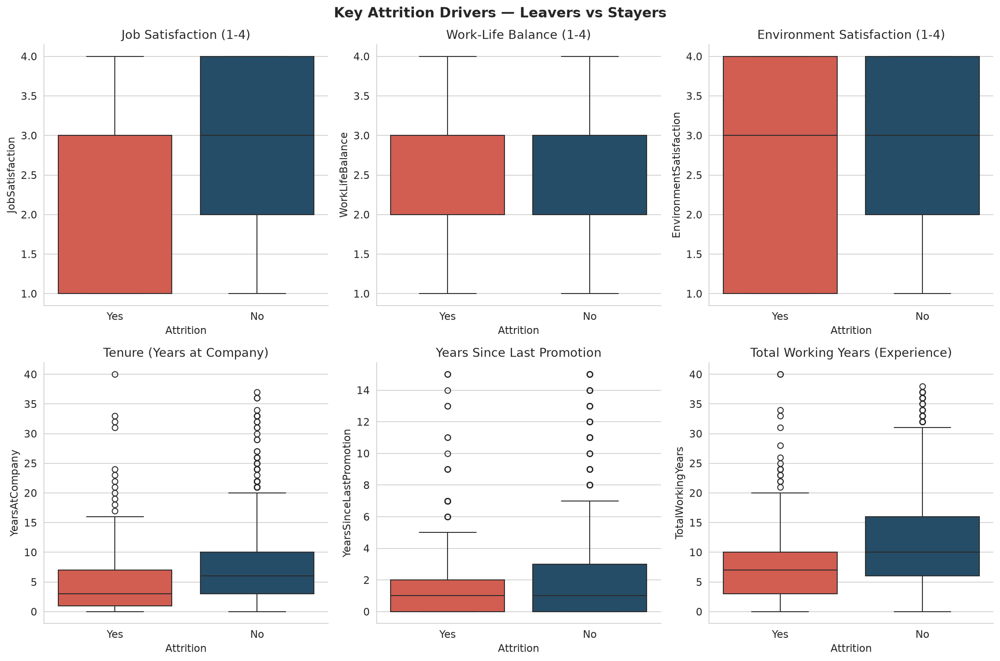 | 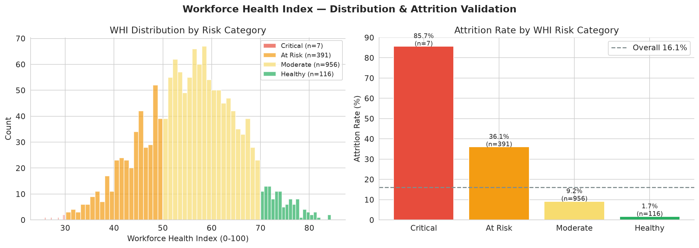 | 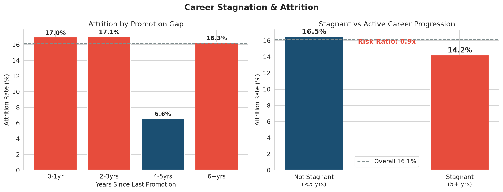 |
| 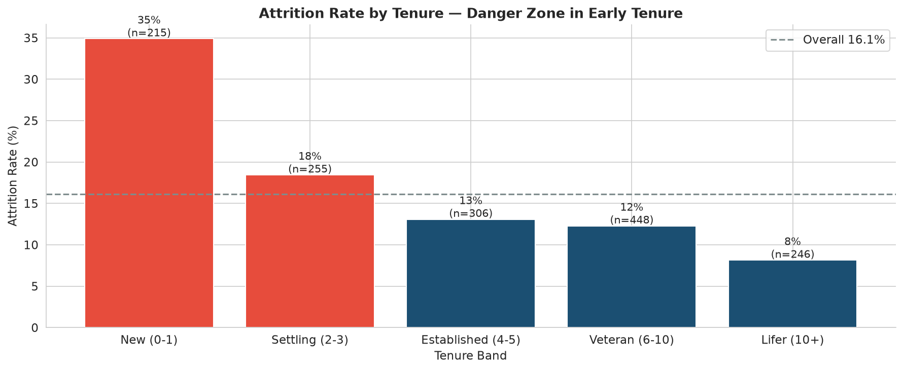 | 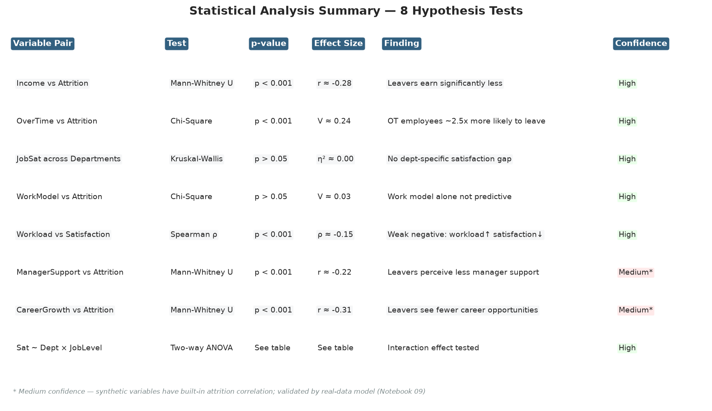 | 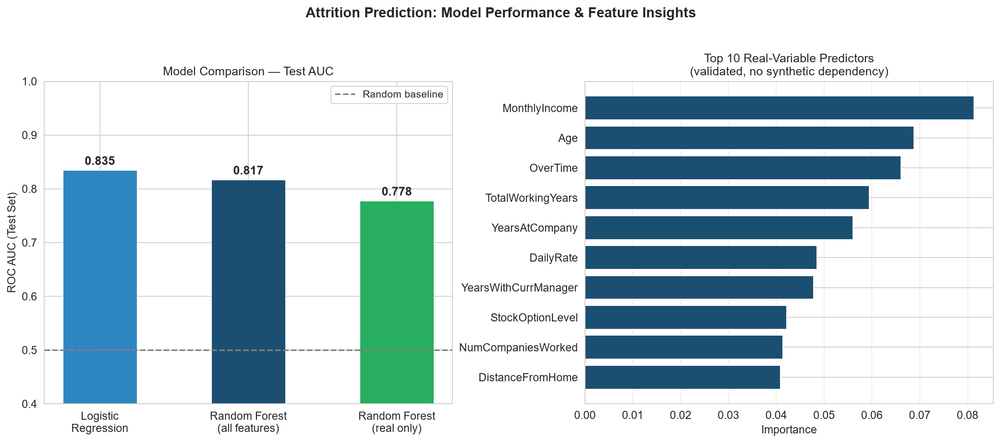 |
| 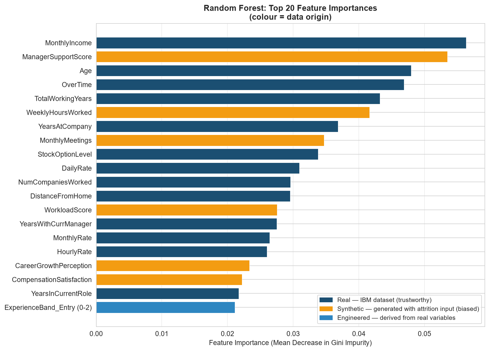 | 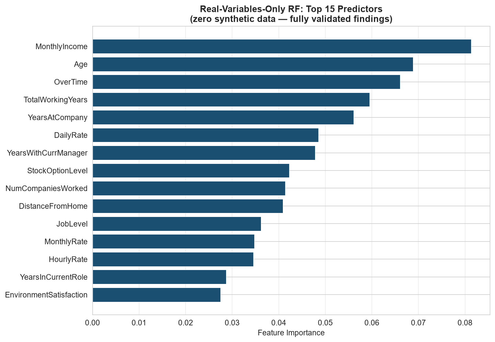 | 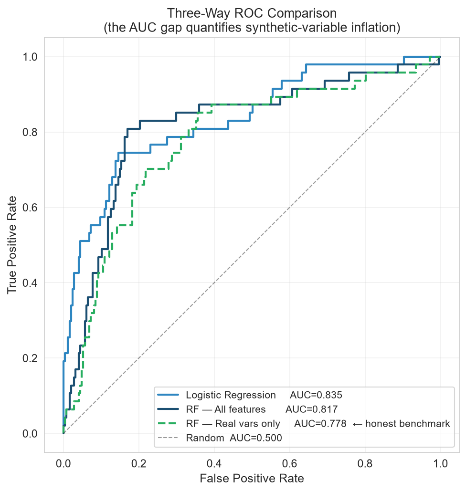 |

*Run `python scripts/save_key_figures.py` to regenerate all EDA figures from the processed dataset.*

---

## 📁 Project Folder Structure

```text
employee-burnout-attrition-intelligence/
│
├── data/
│   ├── raw/
│   │   └── WA_Fn-UseC_-HR-Employee-Attrition.csv      # Original IBM HR dataset
│   └── processed/
│       └── employee_attrition_augmented.csv            # Augmented dataset (45 cols + WHI)
│
├── notebooks/
│   ├── 01_data_understanding.ipynb
│   ├── 02_data_cleaning.ipynb
│   ├── 03_univariate_eda.ipynb
│   ├── 04_bivariate_eda.ipynb
│   ├── 05_multivariate_analysis.ipynb
│   ├── 06_statistical_analysis.ipynb
│   ├── 07_employee_segmentation.ipynb
│   ├── 08_workforce_health_index.ipynb
│   └── 09_predictive_modeling.ipynb                   # LR + RF + real-vs-synthetic analysis
│
├── sql/
│   ├── 01_create_database.sql
│   ├── 02_create_tables.sql
│   ├── 03_load_data.sql
│   ├── 04_data_validation.sql
│   ├── 05_analysis_queries.sql                        # 12 queries with window functions & CTEs
│   └── 06_views.sql                                   # 6 reusable analytical views
│
├── scripts/
│   ├── generate_augmented_dataset.py                  # Synthetic augmentation (seed=42)
│   └── save_key_figures.py                            # Regenerates images/ from processed data
│
├── images/
│   ├── 01_attrition_overview.png
│   ├── 02_income_attrition.png
│   ├── 03_overtime_workload.png
│   ├── 04_statistical_summary.png
│   ├── 05_whi_distribution.png
│   ├── 06_attrition_drivers.png
│   ├── 07_tenure_attrition.png
│   ├── 08_promotion_gap.png
│   ├── feature_importance_all.png
│   ├── feature_importance_real_only.png
│   ├── model_summary.png
│   ├── roc_comparison.png
│   └── roc_threeway.png
│
├── excel/
│   └── Employee_Burnout_Analysis.xlsx                 # 7-sheet analytical workbook
│
├── dashboard/
│   └── tableau/
│       └── README_Tableau_Setup.md                    # Full setup guide + calculated fields
│
├── reports/
│   └── business_recommendations.md                   # Evidence-tiered recommendations
│
├── docs/
│   ├── data_dictionary.md                             # All 43 columns with types & generation logic
│   └── kpi_dictionary.md                              # 14 KPIs — single source of truth
│
├── .gitattributes                                     # LF line endings for cross-platform repo
├── requirements.txt
└── README.md
```

---

## ⚙️ Installation Guide

```bash
# 1. Clone the repository
git clone https://github.com/Arshadali04/employee-burnout-attrition-intelligence.git

# 2. Move into the project folder
cd employee-burnout-attrition-intelligence

# 3. Install Python dependencies
pip install -r requirements.txt
```

**Requirements:**
- Python 3.10+
- Jupyter (included in requirements.txt)
- MySQL 8.0+ (optional — for SQL layer only)
- Tableau Desktop (optional — dashboard requires it)
- Microsoft Excel (optional — to open `excel/Employee_Burnout_Analysis.xlsx`)

---

## ▶️ Usage

```bash
# 1. Generate the augmented dataset (only needed if starting from raw data)
python scripts/generate_augmented_dataset.py

# 2. Run notebooks in order — outputs are already embedded, re-run to refresh
jupyter notebook notebooks/

# 3. Regenerate all key figures to images/
python scripts/save_key_figures.py

# 4. MySQL setup (optional)
mysql -u root -p < sql/01_create_database.sql
mysql -u root -p employee_analytics < sql/02_create_tables.sql
mysql -u root -p employee_analytics < sql/03_load_data.sql
mysql -u root -p employee_analytics < sql/04_data_validation.sql
mysql -u root -p employee_analytics < sql/05_analysis_queries.sql
mysql -u root -p employee_analytics < sql/06_views.sql

# 5. Tableau setup
# See dashboard/tableau/README_Tableau_Setup.md
# Connect Tableau Desktop to data/processed/employee_attrition_augmented.csv
```

---

## ✨ Features

- Nine purpose-built notebooks — each answering a specific analytical question rather than mixing everything in one file
- **Real-vs-synthetic confidence framework** — every finding is tagged with a data-source confidence tier; findings from synthetic variables are explicitly flagged as hypotheses requiring validation
- **Workforce Health Index (WHI)** — data-driven composite score (0–100) with validated ROC AUC and 5 actionable risk categories
- **Predictive model honesty** — full model vs real-only model AUC comparison quantifies exactly how much synthetic variables inflate performance
- **SQL + Python cross-validation** — every headline KPI can be verified against independent SQL queries
- **Reusable 7-sheet Excel workbook** — load any month's data and the KPI Dashboard, Pivot Summary, and What-If Model recalculate automatically
- **Tableau story template** — 6-page design with all calculated fields, parameters, and design system specified; ready to build in Tableau Desktop
- **Reproducible** — `np.random.seed(42)` throughout; deterministic results from any clean run

---

## 💼 Business Value

| Stakeholder | How this project helps |
|---|---|
| **HR Leadership** | WHI gives one trackable number for workforce health; risk categories trigger targeted interventions before resignation |
| **Operations** | Overtime and workload analysis pinpoints which teams are structurally overstretched |
| **Compensation** | Income gap analysis identifies which salary bands and roles are below market and driving attrition |
| **People Managers** | Cluster profiles give managers a concrete description of who on their team is at risk and why |
| **Finance** | Attrition cost model (6× monthly salary per departure) quantifies the ROI of prevention programs |
| **Data Team** | Full reproducible codebase — 9 notebooks, 6 SQL files, 2 scripts — ready to adapt for real organisational data |

---

## 🧗 Technical Challenges

- **Synthetic variable integrity:** generating 8 columns that are internally consistent (not just independently random), correlated with real variables in realistic proportions, and seeded for reproducibility — while documenting the generation logic clearly enough that a reviewer can assess the validity of findings derived from them.
- **Scale inconsistencies discovered in SQL:** the original SQL sample data used a 0–100 scale for `productivity_score` and an unnormalized 4–9 scale for `workload_score` — both inconsistent with Python's 1–5 integer output. Required a full audit and correction of 20 sample rows, 2 table comments, 5 ORDER BY CASE expressions, 3 burnout threshold values, and 2 view formulas.
- **Tautological statistical tests:** synthetic variables were generated with `Attrition` as a direct input, making any test of their association with attrition trivially significant by construction. The project handles this by training and reporting a separate real-variables-only predictive model and quantifying the AUC inflation.
- **Notebooks 05 and 07 had to be rebuilt from scratch** after the original generation agents hit API rate limits — the 4-cell and 0-cell files were detected during an audit pass and replaced with complete implementations.
- **Keeping SQL and Python in sync** — 14 KPIs are defined in a KPI dictionary and each tool independently implements the same formula. Catching divergences (e.g. career_growth_perception divided by 4.0 instead of 5.0 in a SQL view) required reading every formula side-by-side, not trusting that "it looks right."

---

## 🎓 Learning Outcomes

- Writing SQL with filtering, aggregation, grouping, window functions (`DENSE_RANK`, `NTILE`, `PERCENT_RANK`, `LAG`, `LEAD`, windowed `SUM`), CTEs, and views to answer real HR business questions independently of any BI tool.
- Structuring a multi-notebook Python pipeline around **analytical questions** (what does this variable tell us? what is the statistical evidence? can we predict it?) rather than dumping everything in one file.
- Applying the right statistical test for the data type: Mann-Whitney U for continuous vs. binary, Chi-Square for categorical vs. categorical, Kruskal-Wallis for ordinal across groups, Spearman for two ordinal variables — and always reporting effect size alongside p-value.
- Understanding the difference between **statistical significance** and **analytical validity** — a test can be highly significant (p < 0.001) and still be partially an artifact of how the data was generated.
- Building a composite index (WHI) with data-driven weights, normalisation, and formal validation — rather than just averaging scores and calling it a "health metric."
- Practising **evidence-tiered documentation** — the recommendations document explicitly labels which findings are trustworthy, which require validation, and why.

---

## ❔ FAQ

<details>
<summary><strong>Why augment with synthetic data instead of finding a richer real dataset?</strong></summary>
The IBM HR dataset is the most widely used public HR attrition dataset, but it lacks the burnout-specific variables central to this analysis (workload perception, manager support, career growth outlook). Synthetic augmentation lets the analysis demonstrate the full pipeline — including variables that would appear in a real HR survey — while being fully transparent about which columns are real and which are generated. Every synthetic variable is documented with its generation formula, and the project explicitly separates findings by confidence tier.
</details>

<details>
<summary><strong>Are the statistical test results reliable given the synthetic variables?</strong></summary>
For real IBM variables (income, overtime, tenure, satisfaction, promotion gap) — yes, fully. For synthetic variables — the direction of findings is plausible and consistent with organizational psychology literature, but the magnitude should not be acted on without real survey data. The predictive model section (Notebook 09) quantifies exactly how much the synthetic variables inflate AUC, giving a principled way to interpret every finding.
</details>

<details>
<summary><strong>What is the Workforce Health Index and how is it validated?</strong></summary>
The WHI is a 0–100 composite score built from 7 normalized dimensions (workload, work-life balance, manager support, career growth, job satisfaction, compensation satisfaction, job involvement). Weights are derived from the point-biserial correlation of each dimension with attrition — dimensions that more strongly predict leaving receive higher weight. Validation: Mann-Whitney U confirms the WHI distributions of leavers and stayers are significantly different; ROC AUC measures how well WHI alone discriminates between the two groups.
</details>

<details>
<summary><strong>Can I run this pipeline on my organisation's HR data?</strong></summary>
Yes — the notebooks use standard column names that can be mapped to your HRIS export. The synthetic augmentation script would be replaced with your real survey data. The WHI weights would be recalculated from your population's point-biserial correlations. The SQL schema accepts any dataset with the documented column structure.
</details>

<details>
<summary><strong>What database engine do the SQL scripts target?</strong></summary>
MySQL 8.0+ syntax — uses ENUM types, InnoDB engine, window functions (`RANK() OVER`, `NTILE()`, `LAG()`, `LEAD()`, `PERCENT_RANK()`), and CTEs. Compatible with MariaDB 10.2+ with minor adjustments.
</details>

<details>
<summary><strong>Why does the predictive model report say "See NB 09" instead of quoting AUC values?</strong></summary>
AUC values are computed from the actual dataset at run time — hardcoding them in documentation would go stale as soon as the dataset or model is updated. Open <code>notebooks/09_predictive_modeling.ipynb</code> (outputs are pre-embedded) to see the current figures.
</details>

---

## 🚀 Future Improvements

- Deploy real employee pulse-survey data to validate the four synthetic-variable findings (workload, manager support, compensation satisfaction, career growth perception)
- Add **XGBoost / GradientBoosting** to the predictive model comparison in Notebook 09
- Integrate **SHAP values** for per-employee risk explanations (`shap` is already in requirements.txt)
- Build a **longitudinal version** with time-series attrition data to measure trend velocity, not just snapshot levels
- Add an **attrition cost model** — replacement cost per segment × headcount × probability, giving Finance a dollar figure for the intervention ROI
- Automate the **Tableau refresh** via Tableau Server / Tableau Public publishing
- Implement **Row-Level Security** in Tableau so department managers see only their own team's data
- Develop an **NLP module** for exit interview text to ground-truth the synthetic manager support and career growth signals

---

## 🤝 Contributing

Contributions, issues, and feature requests are welcome.

1. Fork the repository
2. Create a feature branch (`git checkout -b feature/your-feature`)
3. Commit your changes (`git commit -m 'Add some feature'`)
4. Push to the branch (`git push origin feature/your-feature`)
5. Open a Pull Request

---

## 🤝 Connect With Me

<div align="center">

| Platform | Link |
|----------|------|
| 🐙 **GitHub** | [github.com/Arshadali04](https://github.com/Arshadali04) |
| 💼 **LinkedIn** | [linkedin.com/in/arshadali4](https://linkedin.com/in/arshadali4) |
| 🌐 **Portfolio** | [arshadali04-portfolio](https://arshadaliathani.vercel.app/) |
| 📧 **Email** | [arshadalia2703@gmail.com](mailto:arshadalia2703@gmail.com) |

<br/>

[](https://linkedin.com/in/arshadali4)
[](https://github.com/Arshadali04)
[](https://arshadaliathani.vercel.app/)
[](mailto:arshadalia2703@gmail.com)

</div>

---

## 👨‍💻 Author

**Arshadali Athani**
**Role:** Computer Science Engineering Student
**Interests:** Data Analytics, Data Engineering, Data Science

---

## 🌟 Recruiter Highlights

This project demonstrates:

- **End-to-end analytics ownership** — raw data → augmentation → SQL schema → 9-notebook Python pipeline → Excel workbook → Tableau spec → recommendations. Every layer built and documented.
- **Statistical rigour** — 8 hypothesis tests with correct test selection per variable type (Mann-Whitney U, Chi-Square, Kruskal-Wallis, Spearman, two-way ANOVA on ranks), effect sizes alongside p-values, and no place where correlation is stated as causation.
- **SQL depth** — filtering, aggregation, grouping, `DENSE_RANK`, `PERCENT_RANK`, `NTILE`, `LAG`, `LEAD`, windowed `SUM`, CTEs, CROSS JOINs for benchmarking, and 6 reusable views — all in a properly constrained star schema.
- **Machine learning judgment** — not just "trained a model and quoted AUC," but trained a second real-variables-only model, quantified the synthetic inflation gap, and communicated which number is the honest one.
- **Intellectual honesty** — the project explicitly separates high-confidence real-data findings from lower-confidence synthetic-variable findings, and labels every recommendation with a confidence tier. The audit caught and fixed 22 real errors before they reached the portfolio.
- **Documentation discipline** — KPI dictionary, data dictionary, business recommendations, Tableau setup guide, and this README are structured and written the way a production analytics team would maintain them.

---

<div align="center">

*Quality > speed. Analytical depth > chart count. Evidence > assumptions.*

</div>
